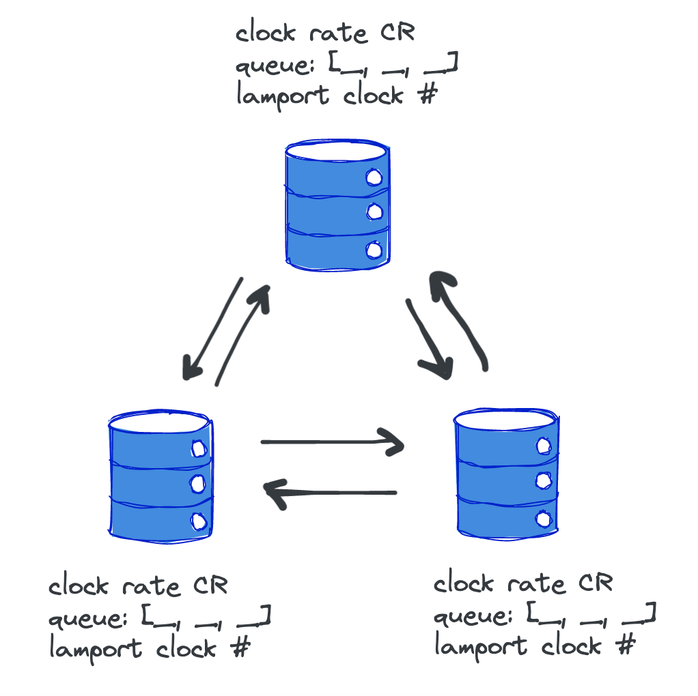

# CS 262 PS 2 Engineering Notebook

## System Design

Per the spec, we designed our system in the following way:

This design does **not** feature a centralized server, runs over sockets, and is designed to be run across multiple machines if necessary.

We used the same wire protocol core from before, with a byte buffering method.

### Interactive vs Non-Interactive Modes

There are **two modes** to our project:
- Interactive:
- Non-interactive:

We were running simulations and saw this happen

interactive and non-interactive modes.

### Observations

Notes

Graphs

Etc.

